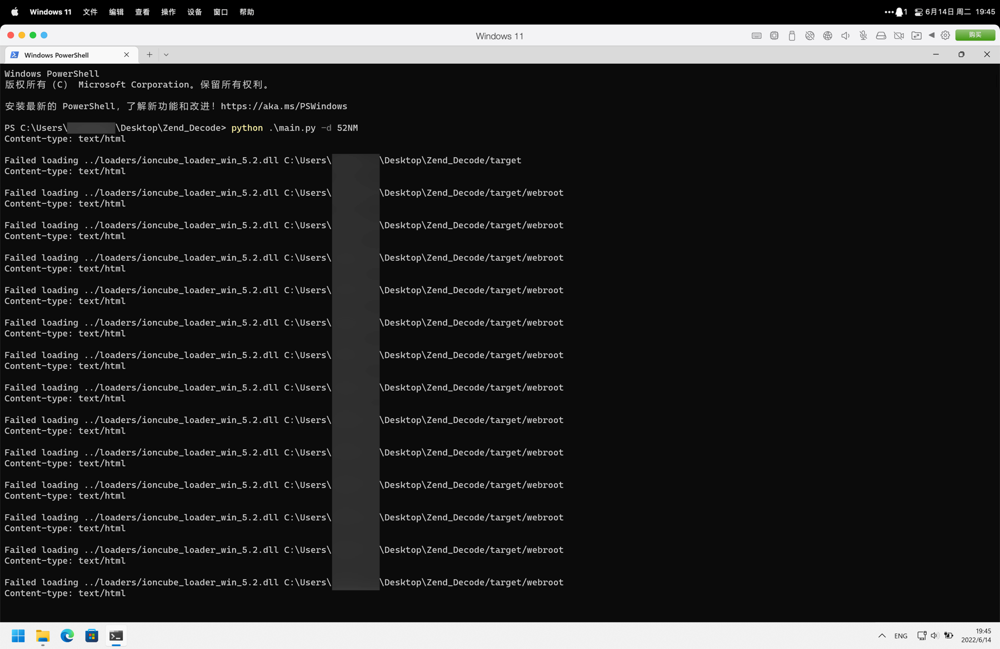

# Zend_Decode
**G-DeZender**要付费才能批量，**SeayDzend**解**5.2NM**返回的是**No input file specified**。  
于是反编译**G-DeZender**，发现也就是调用**lib**包，于是改了一个能使的。  
目前只于**Windows11 ARM**环境下测试了某**OA**的**5.2NM**解密。  
## Versions
- **Zend/PHP5.2【Windows11 ARM下测试可用】**  
- **Zend/PHP5.3【未测试】**  
- **Zend/PHP5.4【未测试】**  
## Usage
```
usage: main.py [-h] [--source_path SOURCE_PATH] [--target_path TARGET_PATH] --decode_type DECODE_TYPE

Zend_Decode

options:
  -h, --help            show this help message and exit
  --source_path SOURCE_PATH, -s SOURCE_PATH
                        源码读取路径，若无指定则读取source
  --target_path TARGET_PATH, -t TARGET_PATH
                        解码保存路径，若无指定则输出到target
  --decode_type DECODE_TYPE, -d DECODE_TYPE
                        解码格式，必要参数，可选为52RM/52NM/53/54
```
## Examples
```
# 源码放进source文件夹，指定解密方式
python .\main.py -d 52NM

# 指定源码路径和解密方式，输出路径指向target文件夹
python .\main.py -d 52NM -s C:\Users\MeiyaPico\Desktop\source

# 指定输出路径和解密方式，源码路径指向source文件夹
python .\main.py -d 52NM -t C:\Users\MeiyaPico\Desktop\target

# 指定源码路径、输出路径和解密方式
python .\main.py -d 52NM -s C:\Users\MeiyaPico\Desktop\source -t C:\Users\MeiyaPico\Desktop\target
```
## Screenshot
